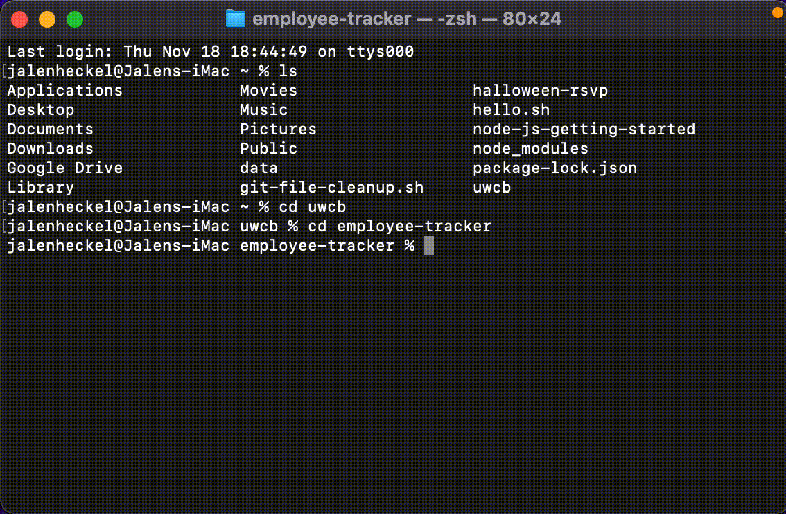

# employee-tracker
A basic app for tracking employee information such as ID, name and department.

## Summary
- using mysql we can add data into a database using the command line and even edit and remove data entered.
- I attempted to make a database with a series of tables to keep track of some employee information for an office inclusing their roles and ids.

## Installation
- clone repo
- npm i dependencies
- navigate into sql folder and source the schema
- npm start

## Features
- a server.js file that contains a majority of the code to provide the prompts to the user and to pass the data through.
- one schema file to seed in some dummy data with some of our favorite seinfeld characters and some old thespians of yore.

## Challenges
- I was able to get the user prompts functioning early on but ran into some challenges with actually navagating the prompts and being able to enter data into the tables. I also had a hard time recalling how to seed a database.

## Repo
GitHub: https://github.com/jheckel-dev/employee-tracker

## Example

